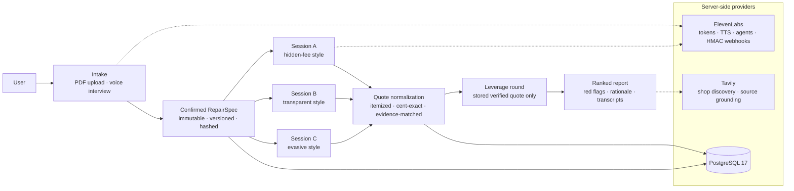

# WrenchBid — The Negotiator (auto repair)

**WrenchBid turns one confirmed repair scope into multiple structured, evidence-backed quotes and negotiates a better price using only genuine stored leverage — so you never overpay for the same job.**

Built for the Hack-Nation × ElevenLabs "The Negotiator" challenge. Main flow:

**Intake** (PDF upload and/or ElevenLabs voice interview) → **review, correct, confirm** an immutable RepairSpec → **three negotiation sessions** against distinct counterparty styles → **itemized quotes with transcript evidence** → **second round using a stored, verified competing quote** → **ranked, explained recommendation** → **user-controlled deletion**.

- 🔗 Live demo: _placeholder — deploy per [docs/deployment.md](docs/deployment.md), then link here_
- 🎥 Demo video: _placeholder — record the 90-second script in [docs/demo-runbook.md](docs/demo-runbook.md)_
- 📋 Challenge compliance map: [docs/challenge-compliance.md](docs/challenge-compliance.md)
- 🧪 Evals: `npm run eval` — 76 deterministic checks, results in [docs/eval-results.md](docs/eval-results.md)

> **Simulation disclosure:** counterparties in the demo are clearly-labeled synthetic Counter Agents or ElevenLabs agent simulations. No real business is contacted, no phone number is dialed, and no simulated offer is binding. This environment has no telephony access; outbound calling code is capability-gated **off**.

## Architecture



The repository contains a server-backed production foundation alongside a deterministic recorded demo. Live actions are deliberately capability-gated: no real call is placed unless the database, ElevenLabs agents, telephony number, consent checks, and selected E.164 shop numbers are all configured — and telephony stays disabled in this environment.

## Start locally

1. Copy `.env.example` to `.env.local` and replace placeholders. Never use `VITE_` for secrets.
2. Start the application and PostgreSQL:

   ```bash
   docker compose --env-file .env.local up --build
   ```

3. Open `http://localhost:3000` and check `http://localhost:3000/api/health`.

The API credentials previously shared in chat are not stored in this repository. Rotate them before use. Outbound calls also require the explicit `OUTBOUND_CALLS_ENABLED=true` operator switch; it is off by default.

Compose publishes the app on `127.0.0.1` by default. Keep that loopback binding for local work. Set `APP_HOST=0.0.0.0` only when external access is deliberate and protected by a firewall and TLS reverse proxy, and set `PUBLIC_APP_URL` to the exact browser-facing origin.

## What is implemented

- PostgreSQL schema and idempotent migrations for projects, documents, versioned specs, shops, campaigns, calls, quotes, evidence, negotiations, audits, and provider webhooks.
- Private PDF upload with MIME/signature/size checks, SHA-256 hashing, protected disk storage, text extraction, evidence confidence, and manual correction.
- Immutable confirmed RepairSpecs and per-campaign JSON snapshots/hash references.
- Server-only Tavily search with bounded cost and a manual verified-shop fallback.
- Private ElevenLabs WebRTC intake tokens and the `update_repair_spec` client-tool bridge.
- Real Twilio/SIP outbound-call orchestration with durable claim-time rechecks for both consents, verified E.164 destinations, and suppression; no unsafe retry follows an ambiguous provider timeout.
- HMAC-verified, retry-safe ElevenLabs webhooks; monotonic terminal outcomes; exact transcript-token quote evidence; authorized audio proxying.
- Genuine-quote negotiation approval and a transparent ranking that flags bids more than 30% below the comparable median.
- A deterministic `/demo/arena` presentation with three synthetic Counter Agents, turn-synchronized ElevenLabs speech, verified-leverage negotiation, and an optional Tavily-grounded ElevenLabs agent simulation.
- Tenant-scoped opaque HTTP-only cookies, CSRF/origin checks, server-only secrets, full cascading deletion, and demo-only browser persistence.
- Docker, health checks, CI workflow, type checks, unit tests, and Markdown operator/agent handoff documentation.

## Commands

```bash
npm ci
npm run dev
npm run typecheck
npm run test
npm run eval
npm run lint
npm run build
npm run db:migrate
npm run start
```

npm and `package-lock.json` are the canonical package manager and dependency lock. Do not introduce a second lockfile.

`npm run db:migrate` requires `DATABASE_URL` to already be exported and reachable from the host. With Compose, migrations run automatically under an advisory lock; use `docker compose --env-file .env.local exec app node scripts/migrate.mjs` for a manual recheck.

## Documentation

- [Production-readiness audit](docs/production-readiness-audit.md) · [Challenge compliance](docs/challenge-compliance.md) · [Limitations](docs/limitations.md)
- [Demo runbook (90-second jury script)](docs/demo-runbook.md)
- [Architecture](docs/ARCHITECTURE.md) · [Deployment](docs/deployment.md) · [Operations](docs/OPERATIONS.md)
- [Model selection](docs/model-selection.md) · [Integrations and agent setup](docs/INTEGRATIONS.md)
- [Eval methodology](docs/eval-methodology.md) · [Eval results](docs/eval-results.md) · [Golden-call evals](docs/EVALS.md)
- [Security](docs/SECURITY.md) · [Threat model](docs/threat-model.md) · [Privacy and data flow](docs/privacy-and-data-flow.md)
- [API contract](docs/API.md) · [Verification ledger](docs/VERIFICATION.md)
- [Counter Agent demo and live architecture](docs/COUNTER_AGENT_DEMO.md) · [Agent handoff](docs/AGENT_HANDOFF.md)

## Deployment boundary

The Docker/Node deployment is suitable for a private pilot once provider configuration, legal review, backups, and monitoring are in place. Anonymous project cookies isolate browser workspaces but are not a substitute for user accounts in a public multi-user product. Add an identity provider before public launch; see the security and handoff documents.
